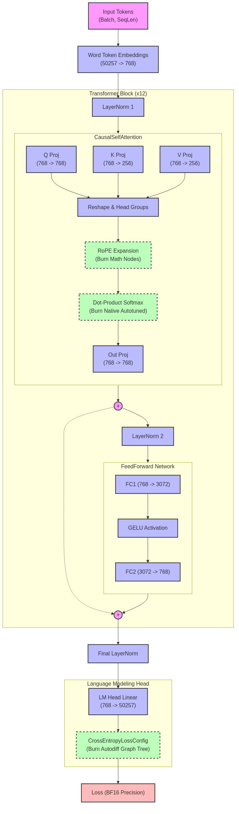

# TinyLLM 🧠🦀



A minimalist, high-performance GPT-2 style language model built entirely in Rust using the `burn` machine learning framework. TinyLLM is designed for educational exploration, rapid prototyping, and executing dynamic JIT-compiled GPU kernels natively without Python runtime overhead.

## Architecture Highlights
*   **Dimensions**: 768 Hidden Size | 12 Attention Heads | 1024 Sequence Length
*   **Vocabulary**: 50,257 (Standard GPT-2 Tokenizer)
*   **Burn Migration**: 
    *   Transitioned the entire computational graph from `candle_core` to the `burn` framework, allowing fluid multi-backend execution (`NdArray` for pure-CPU tests and `Cuda` for high-throughput training).
    *   Replaced hardcoded PTX CUDA kernels with Burn's native backend optimizers (`CubeCL`), allowing optimal operator fusion explicitly handled by the framework rather than manually mapping memory blocks via `nvcc`.
*   **Attention Enhancements**: 
    *   Fully integrated generic **Rotary Positional Embeddings (RoPE)** computed deterministically inside math tensor expansions natively.
    *   Native Causal Masking integration preparing sequential sequences optimally within attention matrices.
*   **Optimizer Subsystem**: Integrates `burn::optim::AdamWConfig` for clean iteration looping, scaling and modifying gradients in-place explicitly via Burn's `Autodiff` execution node traces.
*   **Bias Elimination**: Structurally swapped `Linear` blocks strictly into `linear_no_bias` configurations natively dropping unnecessary broadcast operations globally for an identically matched LLaMA geometry.
*   **Modular Design**: The monolithic codebase is cleanly packaged into isolated domains (`attention`, `block`, `trainer`, `dataset`) decoupling the graph definition from the complex memory/training orchestrators like `burn::train::Learner`.

---

## 🚀 Getting Started

Ensure you have the Rust toolchain and the NVIDIA CUDA Toolkit (v12+) installed.

### 1. Training the Model
The dynamic training loop automatically utilizes `DataLoaderBuilder` over memory mapped files natively, evaluating metrics live explicitly via the `burn::train::Learner` struct.

**New Training Features:**
*   **Custom Metrics**: Native integration of `TokensPerSecond` and `SamplesSeen` (Batch Tracker) tracking custom pipeline throughput.
*   **BF16 Precision & Fused Operations**: Native graphs automatically compile and execute wrapped natively under `burn_fusion` using `Cuda<half::bf16, i32>` precision, inherently slashing VRAM bounds natively.
*   **Learning Rate Scheduler**: Incorporates `burn::lr_scheduler::composed::ComposedLrScheduler` multiplying native `Linear` warmup sweeps cleanly against `CosineAnnealing` bounds dynamically throughout training iterations.
*   **Dataset Slicing**: Dynamically slice datasets statically via parameter blocks (e.g., `--dataset-percentage 10`).

```bash
cargo run --release --bin train -- --dataset-percentage 100
```

### 2. Text Generation
Interact with the language model using stochastic Temperature Sampling natively across `generate.rs`. It explicitly scans for the highest `.mpk` `CompactRecorder` serializations in `checkpoints` directory to leverage pre-trained Burn graph dimensions.

```bash
cargo run --release --bin generate "The Apollo 11 moon landing was "
```

### 3. Evaluating Accuracy
Runs pure-Rust validation suite evaluating perplexing and native log-probs over datasets like **HellaSwag**! Parses tokens locally and routes tensors against Burn's native CUDA contexts deterministically.

```bash
cargo run --release --bin eval
```

---

## 🤖 Agent Skills
The workspace includes automated `.agent/skills` workflows to make grooming and executing the code as frictionless as possible.

*   **Linter**: Automatically runs `cargo fmt`, `cargo clippy`, and `cargo shear`!
    *   `bash .agent/skills/linting/scripts/run_lint.sh`
*   **Generator**: Wraps the inference binary.
    *   `bash .agent/skills/generation/scripts/test_generation.sh "Your prompt here"`
*   **Evaluator**: Compiles and executes the HellaSwag log-prob evaluator.
    *   `bash .agent/skills/evaluation/scripts/run_eval.sh`
*   **Profiler**: Tracks runtime execution using `nsys` explicitly mapping out kernel bottlenecks.

---
